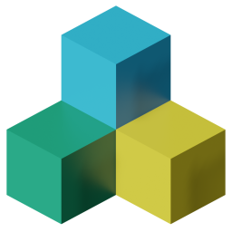

<h1>
  

     
    ObjToSchematic 
  

</h1>

  A visual tool to convert 3D .obj models into Minecraft structures (.schematic, <a href="https://www.curseforge.com/minecraft/mc-mods/litematica/files">.litematic</a>, <a href="https://github.com/SpongePowered/Schematic-Specification">.schem</a>, .nbt)
   
  <b><a href="https://objtoschematic.com">Online</a></b> •
  <b><a href="https://github.com/LucasDower/ObjToSchematic/releases/latest">Desktop (Legacy)</a></b>

  <a href="#usage">Usage</a> •
  <a href="https://discord.gg/McS2VrBZPD">Discord</a> •
  <a href="#contributing">Contributing</a> •
  <a href="#gallery">Gallery</a>

  
  
  
  

   
  "Noodle Bowl - 3DDecember Day9" (https://skfb.ly/orI9z) by Batuhan13 is licensed under Creative Commons Attribution (http://creativecommons.org/licenses/by/4.0/).

## Usage

> [!IMPORTANT]  
> This is an non-commercial **unofficial** tool that is neither approved, endorsed, associated, nor connected to Mojang Studios. Block textures used are from Minecraft and usage complies with the [Mojang Studios Brand And Assets Guidelines](https://account.mojang.com/terms#brand).

**ObjToSchematic** is live at https://objtoschematic.com!

If you want make changes to the repo and run the editor locally then you must:
* Download and install [Node.js](https://nodejs.org/en/).
* Run `git clone https://github.com/LucasDower/ObjToSchematic.git` in your command line.
* Navigate to `/ObjToSchematic/Editor`.
* Run `npm install`.
* Run `npm start`.
* Open `localhost:8080` in a web browser.

  

## Contributing
Any contributions are welcome, just fork and submit a PR!

ObjToSchematic is split into three packages, `Core`, `Editor`, and `Sandbox`:
* `Core` contains the main functionality of OtS and exposes an API to load 3D models, convert them into voxel meshes and block meshes and finally export them to various file formats. The API also offers classes for programatically building custom meshes, voxel meshes, and block meshes. Notable classes include:
  * `OtS_Mesh`, `OtS_VoxelMesh`, `OtS_BlockMesh`, `OtS_VoxelMeshConverter`, `OtS_BlockMeshConverter`.
* `Editor` contains the source for the web interface. Calls to `OtS-Core` are performed in a separate worker to avoid blocking the UI. The editor comes with localisation support and, regretfully, makes use of a custom UI framework. Notable files include:
  * `app_context.ts` 
* `Sandbox` contains example uses of `OtS-Core`.

If you have any questions or need help getting started then feel free to join the [Discord](https://discord.gg/McS2VrBZPD) or message me **SinJi#4165**.

### Translations
Translations files are stored in `/ObjToSchematic/Editor/loc/`. To add a new language, duplicate the `en_GB.ts` file, rename it to the language code you are adding. The `en_GB.ts` file is the main language file. All the possible translation keys that you can override exist in `en_GB.ts`. Your translation file does not need to override every key, missing translations will fallback to the British English translation. Translation files are checked at compile-time for invalid keys. Once your translation file is complete, modify `/loc/base.ts` to include your new language. And that's it! Visit the [i18next](https://www.i18next.com/) documentation if your language requires special attention such as plurals or visit the Discord for help or if the current implementation isn't sufficient for your language.

## Gallery

   
  "Creepy Lady Bust Statue Scan" (https://skfb.ly/6B7pK) by alex.toporowicz is licensed under Creative Commons Attribution (http://creativecommons.org/licenses/by/4.0/).
   
   
  "Pivot Demo: Journey" (https://skfb.ly/6WCIJ) by Sketchfab is licensed under Creative Commons Attribution (http://creativecommons.org/licenses/by/4.0/).
   
   
  "Handpainted Pancake" (https://skfb.ly/6T7yN) by Marvi is licensed under Creative Commons Attribution (http://creativecommons.org/licenses/by/4.0/).

## Editor Documentation
Below is a detailed explanation into what each configurable setting does divided into each step in the program.

### Import
* **Wavefront .obj file** - This is the actual 3D model you want to voxelise. Please note that the more complex your model is the longer it will take to voxelise. It is strongly recommended that you simplify your geometry in a program such as Blender to reduce the poly count. If your triangles are smaller than the size of the voxels then you will not notice the difference and the extra detail is just wasting resources.
* **Rotation** - Change to rotate the mesh, requires clicking 'Load mesh' to update.

### Materials
Here is where you can edit the materials that the loaded model uses. Any changes you make require you to commit the changes by clicking 'Update materials'.
* **Type** - Switch between a Solid material or a Textured material. Note, only materials that're used by triangles with defined texcoords can be turned into Textured materials.
* Solid Materials
  * **Colour** - The actual colour of the material.
  * **Alpha** - The transparency value.
* Textured Materials
  * **Diffuse map** - The actual texture file the colour data is from.
  * **[Filtering](https://en.wikipedia.org/wiki/Texture_filtering)** - How pixel values are sampled.
  * **[Wrap](https://en.wikipedia.org/wiki/Wrapping_(graphics))** - How texcoords outside the [0, 1] range are sampled.
  * **Transparency** - How transparency values are sampled, either 'None' for opaque, 'Alpha map' for custom alpha mask textures, 'Alpha constant' for a flat transparency value or 'Use diffuse map alpha channel'.

### Voxelise
* **Constraint axis** - This determines which axis is used to determine the size of the model. If you choose 'Y' and type in a size of 80 then the voxelised mesh will has a height of 80. If you choose 'X' instead then the width will be 80.
* **Size** - This works in conjunction with *Constraint axis* as described above.
* **Algorithm** - There are many ways to turn a triangle mesh into a voxel mesh and each method produces different results. Here you can choose which one you like the best.
* **Ambient occlusion** - This is a purely visual setting and makes no difference to the outputted structure. [Ambient occlusion](https://en.wikipedia.org/wiki/Ambient_occlusion) displays the shadows between adjacent blocks just like Minecraft. This takes quite a hit to the time to voxelise so consider turning this setting off first.
* **Multisampling** - Multisampling should only be used if your mesh uses textures. It takes multiple samples of the texture to get a more representative colour for a voxel. If your triangles and voxels are a similar size then you'll want this on. If your voxels are much smaller than the triangles then you'll probably not notice the difference this makes unless your texture is very noisey.
* **Voxel overlap** - When two triangles next to each other are voxelised one after another the second triangle may place voxels in positions where the first triangle has already placed a voxel. This setting allows you to only take the *First* voxel colour or take an *Average*.

### Assign
* **Texture atlas** - The textures to use for each block. This also determines how colour-conversions are made.
* **Block palette** - What collection of blocks are available to choose from.
* **Dithering** - *An [image](https://en.wikipedia.org/wiki/Dither) speaks a thousand words.*
* **Fallable blocks** - There's a chance a block is placed such as Sand which when actually placed is going to fall under gravity. You probably don't want this to happen so *Replace falling with solid* will substitute the falling block for a similarly coloured block. Alternatively, you can *Do nothing* or replace any gravity-effected block with *Replace fallable with solid*.
* **Colour accuracy** - This bins together similar colours to speed up colour-to-block conversions. This is a logarithmic scale.
* **Smart averaging** - When performing colour-to-block conversions only block faces that are visible are used in calculating the 'average' face colour. There's no reason to turn this off apart from it being slower.
* **Smoothness** - A high smoothness value will prevent block with noisey textures being used. This is very sensitive to small changes. High smoothness values will decrease the colour accuracy as under-the-hood it is trading off colour error for std error.
* **Calculate lighting** - Turn this on if you want don't want night-vision in the editor. Only turn this on if you really need it as it is considerably slower.
* **Light threshold** - Requires *Calculate lighting* to be on. Will place light blocks (not the [Light Block](https://minecraft.fandom.com/wiki/Light_Block)) in places where the light value is less than the threshold. Useful in automatically lighting up the dark areas of your structure.

### Export
* **File format** - The format to save your structure to. The [Litematica](https://www.curseforge.com/minecraft/mc-mods/litematica) format is strongly recommended and is significantly faster to export to for large structures. The Schematic exporter is useful if you still play in 1.12 as it uses the old block ID system before The Flattening, however many new blocks cannot be encoded in this format so they will be turned into Stone blocks. The NBT exporter is used for Minecraft's [structure blocks](https://minecraft.fandom.com/wiki/Structure_Block). The OBJ exporter can be used to render your structres in a program such as Blender.
