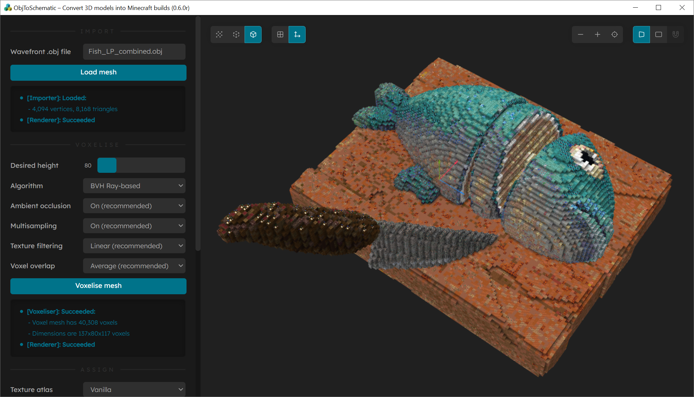

<h1>
  

     
    ObjToSchematic 
  

</h1>

  A visual tool to convert 3D .obj models into Minecraft structures (.schematic, <a href="https://www.curseforge.com/minecraft/mc-mods/litematica/files">.litematic</a>, <a href="https://github.com/SpongePowered/Schematic-Specification">.schem</a>, .nbt)
   
  <a href="#usage">Usage</a> •
  <a href="https://github.com/LucasDower/ObjToSchematic/releases/latest">Download</a> •
  <a href="#progress">Progress</a> •
  <a href="#disclaimer">Disclaimer</a> •
  <a href="https://discord.gg/McS2VrBZPD">Discord</a> •
  <a href="#contributing">Contributing</a> •
  <a href="#gallery">Gallery</a>

  
  
  

  
  "Noodle Bowl - 3DDecember Day9" (https://skfb.ly/orI9z) by Batuhan13 is licensed under Creative Commons Attribution (http://creativecommons.org/licenses/by/4.0/).

## Usage
You can either download the [latest release](https://github.com/LucasDower/ObjToSchematic/releases) or if you want the latest features you can build it yourself by following the instructions below.

* Download and install [Node.js](https://nodejs.org/en/).
* Run `git clone https://github.com/LucasDower/ObjToSchematic.git` in your command line.
* Navigate to `/ObjToSchematic-main`.
* Run `npm install`.
* Run `npm start`.

  
  "Cut Fish" (https://skfb.ly/orWLC) by Suushimi is licensed under Creative Commons Attribution-NonCommercial (http://creativecommons.org/licenses/by-nc/4.0/).

### Advanced

#### Block Palettes
You can create your own block palettes to fit the build you desire. When you select this palette, the generated structure will only use the blocks defined in your palette. To create a palette, list every block you want to use in `/tools/new-palette-blocks`. A list of every supported block can be found in `/tools/all-supported-blocks`. When your list is complete, run `npm run palette`, (make sure you run `npm run build` before  the first time you do this). If everything is successful, the next time you run the program you'll be able to select your new palette in the 'Block palette' dropdown.

#### Texture Atlases
If you play Minecraft with a resource pack, you will probably want to build your own texture atlas. This way the program will use the same resource pack for its visualisation and more accurate colour-to-block conversions can be made. To do this, run `npm run atlas` (make sure you run `npm run build` before the first time you do this) and follow the instructions. If everything is successful, the next time you run the program you'll be able to select your resource pack in the 'Texture atlas' dropdown.

#### Headless
If you want to use the program without using the GUI, you can edit `/tools/headless-config.ts` and run `npm run headless` (make sure to run `npm run build` after **each time** you edit the `headless-config.ts`).

## Progress
[0.1](https://github.com/LucasDower/ObjToSchematic/releases/tag/v0.1-alpha)
* 🟢 **.json model loading**
* 🟢 **Model voxelisation**
* 🟢 **Optimised voxelisation & rendering overhaul**
* 🟢 **Basic .obj file loader UI**

[0.2](https://github.com/LucasDower/ObjToSchematic/releases/tag/v0.2-alpha)
* 🟠 <s>**Greedy voxel meshing**</s> (Removed)
* 🟢 **Export to schematic**

[0.3](https://github.com/LucasDower/ObjToSchematic/releases/tag/v0.3-alpha)
* 🟠 <s>**Voxel splitting**</s> (Removed)
* 🟢 **Ambient occlusion**
* 🟢 **Quality of life**
  * Model PSR, height limit warnings
* 🟢 **.mtl support for block choice**
  * PNG support, JPEG support
* 🟢 **Convert to TypeScript**

[0.4](https://github.com/LucasDower/ObjToSchematic/releases/tag/v0.4-alpha)
* 🟢 **Block choice exported**
  * Export to .litematic
* 🟢 **Support for non-uniform block models** (i.e. not all sides have same texture e.g. Oak Log, Crafting Table)
* 🟢 **UI Redesign**
* 🟢 **Optimised ambient occlusion**
* 🟢 **Transition to ray-based voxelisation**
* 🟢 **Dithering**

[0.5](https://github.com/LucasDower/ObjToSchematic/releases/tag/v0.5-alpha)
* 🟢 **Load custom block palettes and texture atlases**
  * Added custom tool scripts for building atlases and palettes 
* 🟢 **Major refactor for extendibility**
  * New interfaces: IImporter, IVoxeliser, IBlockAssigner, IExporter
* 🟢 **QoL editor impovements**
  * Switch between Mesh/Voxel Mesh/Block Mesh rendering, zoom accessibility options, camera translation/centreing
  * Debug draw options: grid, wireframe, normal, voxel algorithm debug
* 🟢 **Headless launch option**
* 🟢 **New voxelising algorithms**
  * Normal-corrected ray-based (NCRB)
  * BVH-accelerated ray-based
* 🟢 **Optimise construction of voxel mesh vertex buffers**
* 🟢 **Buffer refactor to support `OES_element_index_uint` WebGL extension (support for uint32 index buffers instead of uint16)**

[0.6](https://github.com/LucasDower/ObjToSchematic/releases/tag/v0.6.0)
* 🟢 **Web workers**
  * Processing UI animation
  * Prevent UI hanging
* 🟢 **Options for handling falling blocks and overlapping voxels**
* 🟢 **Sponge schematics exporter (.schem)**
* 🟢 **Structure blocks exporter (.nbt)**
* 🟢 **Alpha support**
  * Alpha texture maps
  * Transparent blocks
* 🟢 **Config file**
* 🟢 **Log files**

0.7
* ⚪ Update .atlas format
* ⚪ Localisation support (message me if you want to add your language!)
* ⚪ .fbx importer
* ⚪ UI for creating palettes
* ⚪ Height-map and colour-map support
* ⚪ Complete code documentation
* ⚪ Realistic lighting instead of night-vision everywhere
* ⚪ Block painting (be able to select blocks and swap them for another)
* ⚪ Add option for setting seed for RNG
* ⚪ .tga support
* ⚪ Material editing - find missing textures, change material colours
* ⚪ Support for splitting up exported structures
* ⚪ Add multisampling to 'bvh-ray' voxeliser

0.8
* ⚪ .gltf importer
* ⚪ Slice viewer 
* ⚪ Support for non-block models (e.g. slabs, stairs, trapdoors, etc.)
* ⚪ Option to simplify complex meshes
* ⚪ Support for non-16x16 resource packs for texture atlases
* ⚪ Reimplement colour-space convertions
* ⚪ Add documentation about how to add modded blocks

## Disclaimer
:warning: This repo is in development and proper error handling is not currently my priority. Contributions are welcome.

This is an non-commercial **unofficial** tool that is neither approved, endorsed, associated, nor connected to Mojang Studios. Block textures used are from Minecraft and usage complies with the [Mojang Studios Brand And Assets Guidelines](https://account.mojang.com/terms#brand).

## Contributing
Any contributions are welcome, just fork and submit a PR! Just make sure the code style follows the rulings in the `.eslintrc.json` by running `npm run lint` and the tests all pass by running `npm test`.

Currently there's not much docs but if you're looking for where to get started, look at `app_context.ts` and follow `_import()`, `_voxelise()`, `_assign()`, and `_export()`. If you're looking to add elements to the UI, look at `ui/layout.ts`, I'm not using a UI framework because I'm a nutter. Adding more file formats to import from and export to would be nice. Adding new default block palettes would be great also. 

If you have any questions or need help getting started then feel free to join the [Discord](https://discord.gg/McS2VrBZPD) or message me **SinJi#4165**.

### Debugging
To allow for your favourite debugging tools like breakpoints and call stacks, I've included launch options for debugging in VSCode. Use `Ctrl+Shift+D`, and run "*Debug Main Process*" and once the Electron window has initialised, run "*Attach to Render Process*".

## Gallery

   
  "Creepy Lady Bust Statue Scan" (https://skfb.ly/6B7pK) by alex.toporowicz is licensed under Creative Commons Attribution (http://creativecommons.org/licenses/by/4.0/).
   
   
  "Pivot Demo: Journey" (https://skfb.ly/6WCIJ) by Sketchfab is licensed under Creative Commons Attribution (http://creativecommons.org/licenses/by/4.0/).
   
   
  "Handpainted Pancake" (https://skfb.ly/6T7yN) by Marvi is licensed under Creative Commons Attribution (http://creativecommons.org/licenses/by/4.0/).

